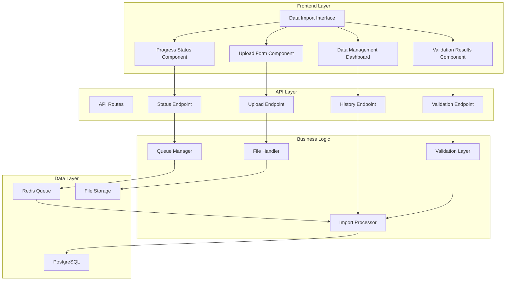
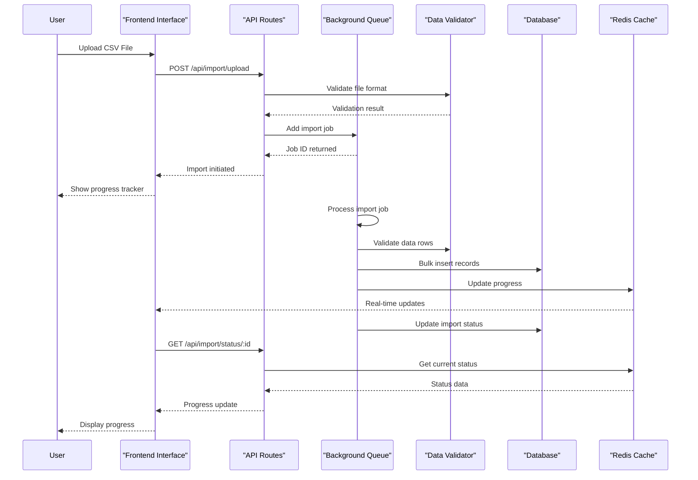
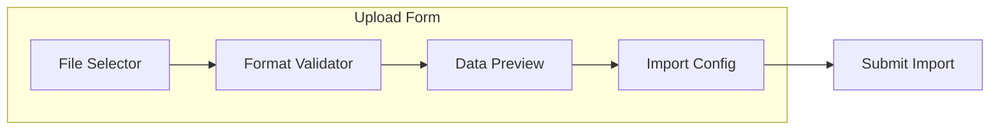
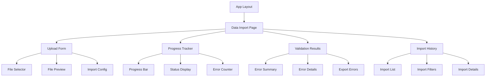

# Backend-Frontend Integration for CSV/API Data Ingestion

## Overview

This design outlines the development of a comprehensive backend-frontend integration system for the Justice Caseload application that enables both CSV file uploads and API-based data ingestion to update the PostgreSQL database. The system will provide a robust, user-friendly interface for data import operations with real-time progress tracking, validation, and error handling.

## Architecture

### System Components Integration



### Data Flow Architecture



## Frontend Components

### Data Import Interface

The main interface component will provide a comprehensive data import experience with the following features:

#### Upload Form Component
- **File Selection**: Drag-and-drop area with file browser fallback
- **Format Validation**: Client-side validation for CSV format and file size limits
- **Preview Capability**: Display first 10 rows of CSV data for verification
- **Import Configuration**: Options for batch size, error handling preferences



#### Progress Tracking Component
- **Real-time Updates**: WebSocket or polling-based progress updates
- **Visual Indicators**: Progress bars, step indicators, and status badges
- **Error Display**: Real-time error reporting with actionable insights
- **Cancel Functionality**: Ability to cancel in-progress imports

#### Validation Results Component
- **Summary Statistics**: Total records, successful imports, errors
- **Error Details**: Expandable error list with row numbers and descriptions
- **Download Options**: Export error reports and successful import summaries
- **Retry Mechanism**: Re-process failed records after corrections

### Component Hierarchy



## API Endpoints Reference

### File Upload API

#### POST /api/import/upload
**Purpose**: Initiate CSV file upload and import process

**Request Schema**:
```typescript
interface UploadRequest {
  file: File; // CSV file (max 10MB)
  config?: {
    batchSize?: number; // Default: 100
    skipErrors?: boolean; // Default: false
    validateOnly?: boolean; // Default: false
  };
}
```

**Response Schema**:
```typescript
interface UploadResponse {
  success: boolean;
  batchId: string;
  message: string;
  previewData?: CaseReturnRow[]; // First 10 rows
  estimatedProcessingTime?: number; // In seconds
}
```

#### GET /api/import/status/:batchId
**Purpose**: Get real-time import progress and status

**Response Schema**:
```typescript
interface ImportStatus {
  batchId: string;
  status: 'PENDING' | 'PROCESSING' | 'COMPLETED' | 'FAILED';
  progress: number; // 0-100
  totalRecords: number;
  processedRecords: number;
  successfulRecords: number;
  failedRecords: number;
  errors: ImportError[];
  estimatedTimeRemaining?: number;
  startedAt: Date;
  completedAt?: Date;
}
```

### Import Management API

#### GET /api/import/history
**Purpose**: Retrieve import history with filtering and pagination

**Query Parameters**:
```typescript
interface HistoryQuery {
  page?: number;
  limit?: number;
  status?: ImportStatus['status'];
  startDate?: string;
  endDate?: string;
  userId?: string;
}
```

#### DELETE /api/import/:batchId
**Purpose**: Cancel active import or mark as cancelled

#### POST /api/import/:batchId/retry
**Purpose**: Retry failed import with corrected data

### Data Validation API

#### POST /api/validate/csv
**Purpose**: Validate CSV structure without importing

**Request**: Multipart form data with CSV file

**Response**:
```typescript
interface ValidationResponse {
  valid: boolean;
  errors: ValidationError[];
  warnings: ValidationWarning[];
  recordCount: number;
  previewData: CaseReturnRow[];
}
```

## Data Models & Database Integration

### Import Batch Tracking

The existing `DailyImportBatch` model will be extended to support enhanced tracking:

```sql
-- Extended import batch table
ALTER TABLE daily_import_batch ADD COLUMN IF NOT EXISTS
  estimated_completion_time TIMESTAMP,
  processing_start_time TIMESTAMP,
  user_config JSONB,
  validation_warnings JSONB[];

-- Import progress tracking
CREATE TABLE IF NOT EXISTS import_progress (
  id UUID PRIMARY KEY DEFAULT gen_random_uuid(),
  batch_id UUID REFERENCES daily_import_batch(id) ON DELETE CASCADE,
  progress_percentage INTEGER CHECK (progress_percentage >= 0 AND progress_percentage <= 100),
  current_step VARCHAR(100),
  message TEXT,
  updated_at TIMESTAMP DEFAULT NOW()
);
```

### Enhanced Error Handling

```sql
-- Enhanced error logging
CREATE TABLE IF NOT EXISTS import_error_details (
  id UUID PRIMARY KEY DEFAULT gen_random_uuid(),
  batch_id UUID REFERENCES daily_import_batch(id) ON DELETE CASCADE,
  row_number INTEGER,
  column_name VARCHAR(100),
  error_type VARCHAR(50),
  error_message TEXT,
  raw_value TEXT,
  suggested_fix TEXT,
  severity VARCHAR(20) DEFAULT 'ERROR',
  created_at TIMESTAMP DEFAULT NOW()
);
```

## Business Logic Layer

### Import Processing Pipeline

The import processor will implement a robust pipeline with the following stages:

#### Stage 1: File Validation
- **Format Check**: Verify CSV format and structure
- **Size Validation**: Ensure file size within limits
- **Schema Validation**: Validate column headers against expected schema
- **Duplicate Detection**: Check file checksum against previous imports

#### Stage 2: Data Preprocessing
- **Data Parsing**: Parse CSV using stream processing for memory efficiency
- **Type Conversion**: Convert string data to appropriate types
- **Data Normalization**: Normalize court names, judge names, case types
- **Relationship Resolution**: Resolve foreign key relationships

#### Stage 3: Validation Engine
- **Row-level Validation**: Validate each row against Zod schemas
- **Business Rules**: Apply business logic validation
- **Referential Integrity**: Ensure data consistency
- **Duplicate Case Detection**: Identify potential duplicate cases

#### Stage 4: Database Operations
- **Transaction Management**: Use database transactions for consistency
- **Batch Processing**: Process records in configurable batch sizes
- **Error Recovery**: Handle partial failures gracefully
- **Master Data Creation**: Auto-create missing master data entities

### Queue Management System

The existing BullMQ implementation will be enhanced with:

#### Job Types
- **CSV Import Jobs**: Main import processing
- **Validation Jobs**: Pre-import validation
- **Cleanup Jobs**: Post-import cleanup and optimization
- **Retry Jobs**: Reprocessing failed records

#### Job Configuration
```typescript
interface ImportJobConfig {
  batchSize: number; // Records per batch
  maxRetries: number; // Retry attempts for failed batches
  timeout: number; // Job timeout in milliseconds
  priority: number; // Job priority (1-10)
  delay: number; // Delay before processing
}
```

#### Progress Tracking
```typescript
interface JobProgress {
  currentStep: string;
  completedSteps: string[];
  totalSteps: number;
  percentage: number;
  recordsProcessed: number;
  totalRecords: number;
  errors: number;
  warnings: number;
}
```

## State Management

### Frontend State Architecture

The frontend will use a combination of React Query and Zustand for state management:

#### Import State Store
```typescript
interface ImportStore {
  // Current import state
  currentImport: ImportSession | null;
  
  // Upload state
  uploadProgress: number;
  isUploading: boolean;
  
  // Validation state
  validationResults: ValidationResult | null;
  isValidating: boolean;
  
  // Import history
  importHistory: ImportBatch[];
  
  // Actions
  startImport: (file: File, config?: ImportConfig) => Promise<void>;
  cancelImport: (batchId: string) => Promise<void>;
  retryImport: (batchId: string) => Promise<void>;
  clearValidation: () => void;
}
```

#### Real-time Updates
```typescript
// React Query for real-time status updates
const useImportStatus = (batchId: string) => {
  return useQuery({
    queryKey: ['import-status', batchId],
    queryFn: () => fetchImportStatus(batchId),
    refetchInterval: 2000, // Poll every 2 seconds
    enabled: !!batchId,
  });
};
```

## Middleware & Interceptors

### Request Validation Middleware
```typescript
// File upload validation
export const validateFileUpload = (req: Request, res: Response, next: NextFunction) => {
  const { file } = req;
  
  if (!file) {
    return res.status(400).json({ error: 'No file provided' });
  }
  
  if (file.size > IMPORT_CONFIG.MAX_FILE_SIZE) {
    return res.status(400).json({ error: 'File too large' });
  }
  
  if (!IMPORT_CONFIG.SUPPORTED_FORMATS.includes(file.mimetype)) {
    return res.status(400).json({ error: 'Unsupported file format' });
  }
  
  next();
};
```

### Error Handling Middleware
```typescript
// Global error handler for import operations
export const importErrorHandler = (error: Error, req: Request, res: Response, next: NextFunction) => {
  if (error instanceof ValidationError) {
    return res.status(400).json({
      error: 'Validation failed',
      details: error.errors,
    });
  }
  
  if (error instanceof ImportError) {
    return res.status(422).json({
      error: 'Import processing failed',
      batchId: error.batchId,
      details: error.message,
    });
  }
  
  // Log unexpected errors
  console.error('Unexpected import error:', error);
  res.status(500).json({ error: 'Internal server error' });
};
```

### Authentication Middleware
```typescript
// User authentication for import operations
export const requireAuth = async (req: Request, res: Response, next: NextFunction) => {
  const token = req.headers.authorization?.replace('Bearer ', '');
  
  if (!token) {
    return res.status(401).json({ error: 'Authentication required' });
  }
  
  try {
    const user = await verifyToken(token);
    req.user = user;
    next();
  } catch (error) {
    return res.status(401).json({ error: 'Invalid token' });
  }
};
```

## Testing Strategy

### Unit Testing
- **API Endpoint Tests**: Test all import-related endpoints
- **Validation Tests**: Test data validation schemas and rules
- **Component Tests**: Test React components with various states
- **Service Tests**: Test import processing logic

### Integration Testing
- **End-to-End Import**: Test complete import workflow
- **Database Integration**: Test database operations and transactions
- **Queue Processing**: Test background job processing
- **Error Handling**: Test error scenarios and recovery

### Performance Testing
- **Large File Handling**: Test with files up to size limits
- **Concurrent Imports**: Test multiple simultaneous imports
- **Memory Usage**: Monitor memory consumption during processing
- **Database Performance**: Test database operations under load

### Test Data Management
```typescript
// Test fixtures for CSV import testing
export const testCsvData = {
  validCsv: 'test-data/valid-cases.csv',
  invalidCsv: 'test-data/invalid-cases.csv',
  largeCsv: 'test-data/large-dataset.csv',
  duplicateCsv: 'test-data/duplicate-cases.csv',
};

// Mock import responses
export const mockImportResponse = {
  success: true,
  batchId: 'test-batch-123',
  totalRecords: 100,
  estimatedTime: 60,
};
```