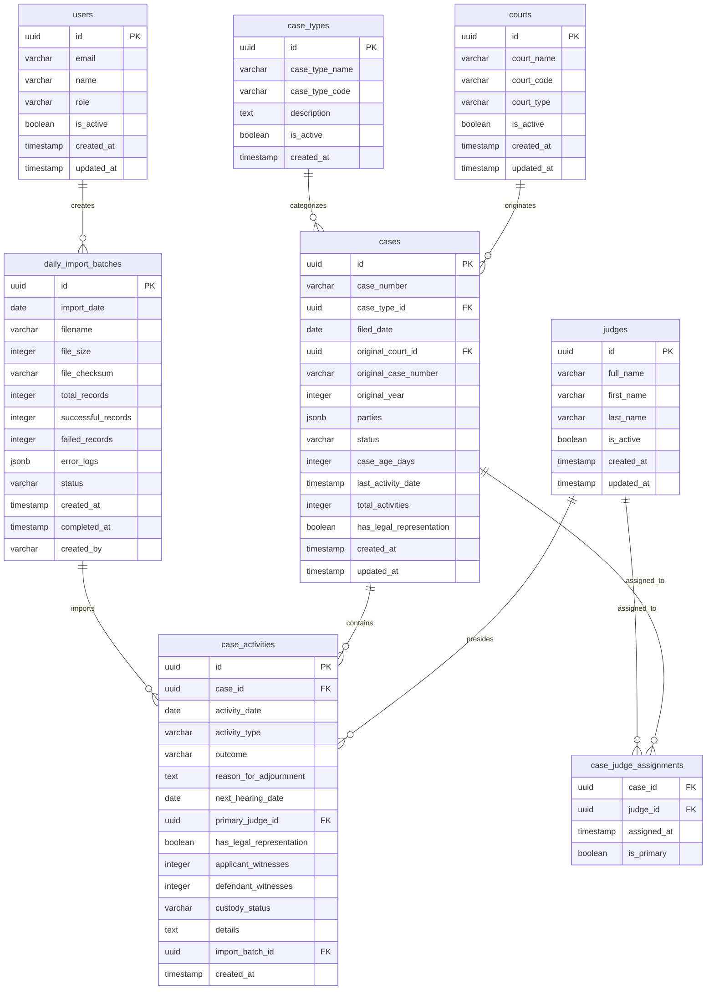

# Database Schema Implementation for Justice Caseload Management System

## Overview

This document outlines the database schema design for the Justice Caseload Management System, a modern web application that processes daily CSV imports of judicial case data. The system is built on Next.js with TypeScript and uses PostgreSQL with Prisma ORM for robust data persistence.

The schema handles daily case returns containing court proceedings, judge assignments, party details, and case outcomes while maintaining data integrity and supporting efficient analytics queries for the dashboard.

## Technology Stack & Architecture

### Database Technology
- **Primary Database**: PostgreSQL 15+ (Open-source relational database)
- **ORM**: Prisma 5.x (Type-safe database client and migration tool)
- **Connection Pooling**: PgBouncer for production connection management
- **Data Validation**: Zod 3.24.2 for schema validation
- **State Management**: TanStack Query (React Query) for caching and synchronization
- **Authentication**: NextAuth.js with database sessions
- **Background Jobs**: BullMQ with Redis for async processing
- **File Processing**: CSV-parser and fast-csv for data import
- **Environment**: Self-hosted or cloud providers (Railway, Supabase, Neon)

### Architectural Decisions
- **Relational Model**: ACID compliance with PostgreSQL for data integrity
- **Normalized Schema**: Proper foreign key relationships with selective denormalization
- **Database Indexes**: B-tree and composite indexes for query optimization
- **Real-time Updates**: Server-sent events or WebSocket connections via Next.js API routes
- **Background Processing**: Queue-based CSV import processing for large files

## Data Models & Schema Design

### Entity Relationship Diagram



### PostgreSQL Schema Definition

#### Prisma Schema (`prisma/schema.prisma`)

```prisma
generator client {
  provider = "prisma-client-js"
}

datasource db {
  provider = "postgresql"
  url      = env("DATABASE_URL")
}

model Court {
  id         String   @id @default(uuid())
  courtName  String   @map("court_name") @db.VarChar(255)
  courtCode  String   @unique @map("court_code") @db.VarChar(50)
  courtType  CourtType @map("court_type")
  isActive   Boolean  @default(true) @map("is_active")
  createdAt  DateTime @default(now()) @map("created_at")
  updatedAt  DateTime @updatedAt @map("updated_at")
  
  // Relations
  cases      Case[]   @relation("OriginalCourt")
  
  @@map("courts")
  @@index([courtType, isActive])
}

model Judge {
  id        String   @id @default(uuid())
  fullName  String   @map("full_name") @db.VarChar(255)
  firstName String   @map("first_name") @db.VarChar(100)
  lastName  String   @map("last_name") @db.VarChar(100)
  isActive  Boolean  @default(true) @map("is_active")
  createdAt DateTime @default(now()) @map("created_at")
  updatedAt DateTime @updatedAt @map("updated_at")
  
  // Relations
  caseActivities     CaseActivity[]     @relation("PrimaryJudge")
  caseAssignments    CaseJudgeAssignment[]
  
  @@map("judges")
  @@index([fullName])
  @@index([isActive])
}

model CaseType {
  id           String   @id @default(uuid())
  caseTypeName String   @map("case_type_name") @db.VarChar(100)
  caseTypeCode String   @unique @map("case_type_code") @db.VarChar(20)
  description  String?  @db.Text
  isActive     Boolean  @default(true) @map("is_active")
  createdAt    DateTime @default(now()) @map("created_at")
  
  // Relations
  cases        Case[]
  
  @@map("case_types")
}

model Case {
  id                     String    @id @default(uuid())
  caseNumber             String    @unique @map("case_number") @db.VarChar(50)
  caseTypeId             String    @map("case_type_id")
  filedDate              DateTime  @map("filed_date") @db.Date
  originalCourtId        String?   @map("original_court_id")
  originalCaseNumber     String?   @map("original_case_number") @db.VarChar(50)
  originalYear           Int?      @map("original_year")
  parties                Json      // JSON object for party counts
  status                 CaseStatus @default(ACTIVE)
  caseAgeDays            Int       @default(0) @map("case_age_days")
  lastActivityDate       DateTime? @map("last_activity_date")
  totalActivities        Int       @default(0) @map("total_activities")
  hasLegalRepresentation Boolean   @default(false) @map("has_legal_representation")
  createdAt              DateTime  @default(now()) @map("created_at")
  updatedAt              DateTime  @updatedAt @map("updated_at")
  
  // Relations
  caseType               CaseType  @relation(fields: [caseTypeId], references: [id])
  originalCourt          Court?    @relation("OriginalCourt", fields: [originalCourtId], references: [id])
  activities             CaseActivity[]
  judgeAssignments       CaseJudgeAssignment[]
  
  @@map("cases")
  @@index([status, filedDate(sort: Desc)])
  @@index([caseTypeId, filedDate(sort: Desc)])
  @@index([filedDate(sort: Desc)])
  @@index([caseNumber])
}

model CaseActivity {
  id                     String    @id @default(uuid())
  caseId                 String    @map("case_id")
  activityDate           DateTime  @map("activity_date") @db.Date
  activityType           String    @map("activity_type") @db.VarChar(100)
  outcome                String    @db.VarChar(100)
  reasonForAdjournment   String?   @map("reason_for_adjournment") @db.Text
  nextHearingDate        DateTime? @map("next_hearing_date") @db.Date
  primaryJudgeId         String    @map("primary_judge_id")
  hasLegalRepresentation Boolean   @map("has_legal_representation")
  applicantWitnesses     Int       @default(0) @map("applicant_witnesses")
  defendantWitnesses     Int       @default(0) @map("defendant_witnesses")
  custodyStatus          CustodyStatus @map("custody_status")
  details                String?   @db.Text
  importBatchId          String    @map("import_batch_id")
  createdAt              DateTime  @default(now()) @map("created_at")
  
  // Relations
  case                   Case      @relation(fields: [caseId], references: [id], onDelete: Cascade)
  primaryJudge           Judge     @relation("PrimaryJudge", fields: [primaryJudgeId], references: [id])
  importBatch            DailyImportBatch @relation(fields: [importBatchId], references: [id])
  
  @@map("case_activities")
  @@index([caseId, activityDate(sort: Desc)])
  @@index([activityDate(sort: Desc)])
  @@index([primaryJudgeId, activityDate(sort: Desc)])
  @@index([outcome, activityDate(sort: Desc)])
}

model CaseJudgeAssignment {
  caseId     String   @map("case_id")
  judgeId    String   @map("judge_id")
  assignedAt DateTime @default(now()) @map("assigned_at")
  isPrimary  Boolean  @default(false) @map("is_primary")
  
  // Relations
  case       Case     @relation(fields: [caseId], references: [id], onDelete: Cascade)
  judge      Judge    @relation(fields: [judgeId], references: [id])
  
  @@id([caseId, judgeId])
  @@map("case_judge_assignments")
}

model DailyImportBatch {
  id               String    @id @default(uuid())
  importDate       DateTime  @map("import_date") @db.Date
  filename         String    @db.VarChar(255)
  fileSize         Int       @map("file_size")
  fileChecksum     String    @map("file_checksum") @db.VarChar(64)
  totalRecords     Int       @map("total_records")
  successfulRecords Int      @map("successful_records")
  failedRecords    Int       @map("failed_records")
  errorLogs        Json      @map("error_logs") // JSON array of errors
  status           ImportStatus
  createdAt        DateTime  @default(now()) @map("created_at")
  completedAt      DateTime? @map("completed_at")
  createdBy        String    @map("created_by")
  
  // Relations
  activities       CaseActivity[]
  user             User      @relation(fields: [createdBy], references: [id])
  
  @@map("daily_import_batches")
  @@index([importDate(sort: Desc)])
  @@index([status])
}

model User {
  id        String   @id @default(uuid())
  email     String   @unique @db.VarChar(255)
  name      String   @db.VarChar(255)
  role      UserRole @default(DATA_ENTRY)
  isActive  Boolean  @default(true) @map("is_active")
  createdAt DateTime @default(now()) @map("created_at")
  updatedAt DateTime @updatedAt @map("updated_at")
  
  // Relations
  importBatches DailyImportBatch[]
  
  @@map("users")
}

// Enums
enum CourtType {
  MAGISTRATE
  HIGH_COURT
  TRIBUNAL
  OTHER
  
  @@map("court_type")
}

enum CaseStatus {
  ACTIVE
  RESOLVED
  PENDING
  TRANSFERRED
  DELETED
  
  @@map("case_status")
}

enum CustodyStatus {
  IN_CUSTODY
  ON_BAIL
  NOT_APPLICABLE
  
  @@map("custody_status")
}

enum ImportStatus {
  PENDING
  PROCESSING
  COMPLETED
  FAILED
  
  @@map("import_status")
}

enum UserRole {
  ADMIN
  DATA_ENTRY
  VIEWER
  
  @@map("user_role")
}
```

### Database Tables Structure

#### Table Descriptions

| Table | Purpose | Key Relationships |
|-------|---------|------------------|
| `courts` | Master data for court information | Referenced by `cases.original_court_id` |
| `judges` | Master data for judge information | Referenced by `case_activities.primary_judge_id` and `case_judge_assignments` |
| `case_types` | Master data for case classifications | Referenced by `cases.case_type_id` |
| `cases` | Primary case records | Parent to `case_activities` and `case_judge_assignments` |
| `case_activities` | Individual court proceedings/activities | Child of `cases`, references `judges` and `daily_import_batches` |
| `case_judge_assignments` | Many-to-many relationship between cases and judges | Junction table |
| `daily_import_batches` | Audit trail for CSV imports | Parent to `case_activities` |
| `users` | Application users and authentication | Referenced by `daily_import_batches.created_by` |

#### Key Database Features

**Data Types:**
- `UUID` for primary keys (better performance and security)
- `JSONB` for flexible nested data (parties information)
- `ENUM` types for constrained values (status, roles)
- `Date` and `Timestamp` for temporal data
- Proper `VARCHAR` sizing based on expected data length

**Indexing Strategy:**
- Primary keys (automatic B-tree indexes)
- Foreign key indexes for join performance
- Composite indexes for common query patterns
- Partial indexes for filtered queries

**Constraints:**
- Foreign key constraints for referential integrity
- Check constraints for data validation
- Unique constraints for business rules
- NOT NULL constraints for required fields

## Data Validation Schema

### Zod Validation for CSV Import

```typescript
import { z } from 'zod';

// CSV row validation schema
export const CaseReturnRowSchema = z.object({
  // Date fields
  date_dd: z.coerce.number().min(1).max(31),
  date_mon: z.string().length(3),
  date_yyyy: z.coerce.number().min(2020).max(2030),
  
  // Case identification
  caseid_type: z.string().min(1).max(20),
  caseid_no: z.string().min(1).max(50),
  
  // Filing information
  filed_dd: z.coerce.number().min(1).max(31),
  filed_mon: z.string().length(3),
  filed_yyyy: z.coerce.number().min(2020).max(2030),
  
  // Original case (for appeals)
  original_court: z.string().optional(),
  original_code: z.string().optional(),
  original_number: z.string().optional(),
  original_year: z.coerce.number().optional(),
  
  // Case details
  case_type: z.string().min(1).max(100),
  judge_1: z.string().min(1).max(255),
  judge_2: z.string().optional(),
  judge_3: z.string().optional(),
  judge_4: z.string().optional(),
  judge_5: z.string().optional(),
  judge_6: z.string().optional(),
  judge_7: z.string().optional(),
  
  // Activity information
  comingfor: z.string().min(1).max(100),
  outcome: z.string().min(1).max(100),
  reason_adj: z.string().optional(),
  
  // Next hearing date (optional)
  next_dd: z.coerce.number().min(1).max(31).optional(),
  next_mon: z.string().length(3).optional(),
  next_yyyy: z.coerce.number().min(2020).max(2030).optional(),
  
  // Party counts
  male_applicant: z.coerce.number().min(0).max(999),
  female_applicant: z.coerce.number().min(0).max(999),
  organization_applicant: z.coerce.number().min(0).max(999),
  male_defendant: z.coerce.number().min(0).max(999),
  female_defendant: z.coerce.number().min(0).max(999),
  organization_defendant: z.coerce.number().min(0).max(999),
  
  // Procedural details
  legalrep: z.enum(['Yes', 'No']),
  applicant_witness: z.coerce.number().min(0).max(999),
  defendant_witness: z.coerce.number().min(0).max(999),
  custody: z.coerce.number().min(0).max(999),
  other_details: z.string().optional(),
});

export type CaseReturnRow = z.infer<typeof CaseReturnRowSchema>;

// Database entity validation schemas
export const CreateCaseSchema = z.object({
  caseNumber: z.string().min(1).max(50),
  caseTypeId: z.string().uuid(),
  filedDate: z.date(),
  originalCourtId: z.string().uuid().optional(),
  originalCaseNumber: z.string().max(50).optional(),
  originalYear: z.number().int().min(1900).max(2030).optional(),
  parties: z.object({
    applicants: z.object({
      maleCount: z.number().int().min(0),
      femaleCount: z.number().int().min(0),
      organizationCount: z.number().int().min(0),
    }),
    defendants: z.object({
      maleCount: z.number().int().min(0),
      femaleCount: z.number().int().min(0),
      organizationCount: z.number().int().min(0),
    }),
  }),
  status: z.enum(['ACTIVE', 'RESOLVED', 'PENDING', 'TRANSFERRED']).default('ACTIVE'),
  hasLegalRepresentation: z.boolean().default(false),
});

export const CreateCaseActivitySchema = z.object({
  caseId: z.string().uuid(),
  activityDate: z.date(),
  activityType: z.string().min(1).max(100),
  outcome: z.string().min(1).max(100),
  reasonForAdjournment: z.string().optional(),
  nextHearingDate: z.date().optional(),
  primaryJudgeId: z.string().uuid(),
  hasLegalRepresentation: z.boolean(),
  applicantWitnesses: z.number().int().min(0).default(0),
  defendantWitnesses: z.number().int().min(0).default(0),
  custodyStatus: z.enum(['IN_CUSTODY', 'ON_BAIL', 'NOT_APPLICABLE']),
  details: z.string().optional(),
  importBatchId: z.string().uuid(),
});

// Helper function to validate and transform dates
export function createDateFromParts(day: number, month: string, year: number): Date {
  const monthMap: Record<string, number> = {
    'Jan': 0, 'Feb': 1, 'Mar': 2, 'Apr': 3, 'May': 4, 'Jun': 5,
    'Jul': 6, 'Aug': 7, 'Sep': 8, 'Oct': 9, 'Nov': 10, 'Dec': 11
  };
  
  const monthIndex = monthMap[month];
  if (monthIndex === undefined) {
    throw new Error(`Invalid month: ${month}`);
  }
  
  const date = new Date(year, monthIndex, day);
  
  // Validate the date is real (handles cases like Feb 30)
  if (date.getDate() !== day || date.getMonth() !== monthIndex || date.getFullYear() !== year) {
    throw new Error(`Invalid date: ${day}/${month}/${year}`);
  }
  
  return date;
}
```

### Database Connection and Client Setup

```typescript
// lib/prisma.ts
import { PrismaClient } from '@prisma/client';

const globalForPrisma = globalThis as unknown as {
  prisma: PrismaClient | undefined;
};

export const prisma = globalForPrisma.prisma ?? new PrismaClient({
  log: ['query', 'error', 'warn'],
  datasources: {
    db: {
      url: process.env.DATABASE_URL,
    },
  },
});

if (process.env.NODE_ENV !== 'production') globalForPrisma.prisma = prisma;

// Database connection health check
export async function checkDatabaseConnection(): Promise<boolean> {
  try {
    await prisma.$queryRaw`SELECT 1`;
    return true;
  } catch (error) {
    console.error('Database connection failed:', error);
    return false;
  }
}

// Graceful shutdown
export async function disconnectDatabase(): Promise<void> {
  await prisma.$disconnect();
}
```

## CRUD Operations Implementation

### Create Operations

#### Daily Data Import with Queue Processing
```typescript
import { prisma } from '@/lib/prisma';
import { Queue } from 'bullmq';
import { Redis } from 'ioredis';
import csv from 'csv-parser';
import { createReadStream } from 'fs';

// Redis connection for BullMQ
const redis = new Redis(process.env.REDIS_URL!);
const importQueue = new Queue('csv-import', { connection: redis });

// Import job data type
interface ImportJobData {
  filePath: string;
  filename: string;
  fileSize: number;
  checksum: string;
  userId: string;
}

// Main import function (API endpoint)
export async function initiateDailyImport(
  filePath: string,
  metadata: Omit<ImportJobData, 'filePath'>
): Promise<{ success: boolean; batchId: string }> {
  try {
    // Create import batch record
    const importBatch = await prisma.dailyImportBatch.create({
      data: {
        importDate: new Date(),
        filename: metadata.filename,
        fileSize: metadata.fileSize,
        fileChecksum: metadata.checksum,
        totalRecords: 0, // Will be updated during processing
        successfulRecords: 0,
        failedRecords: 0,
        errorLogs: [],
        status: 'PENDING',
        createdBy: metadata.userId,
      },
    });

    // Add job to queue for background processing
    await importQueue.add('process-csv-import', {
      ...metadata,
      filePath,
      batchId: importBatch.id,
    });

    return { success: true, batchId: importBatch.id };
  } catch (error) {
    console.error('Failed to initiate import:', error);
    throw new Error('Failed to initiate import process');
  }
}

// Background job processor
export async function processCsvImport(jobData: ImportJobData & { batchId: string }): Promise<void> {
  const { filePath, batchId } = jobData;
  const errors: any[] = [];
  let totalRecords = 0;
  let successfulRecords = 0;

  try {
    // Update status to processing
    await prisma.dailyImportBatch.update({
      where: { id: batchId },
      data: { status: 'PROCESSING' },
    });

    // Process CSV file
    const csvData: CaseReturnRow[] = [];
    
    await new Promise<void>((resolve, reject) => {
      createReadStream(filePath)
        .pipe(csv())
        .on('data', (row) => {
          csvData.push(row);
        })
        .on('end', resolve)
        .on('error', reject);
    });

    totalRecords = csvData.length;

    // Process each row in transactions
    for (let i = 0; i < csvData.length; i++) {
      const row = csvData[i];
      
      try {
        await prisma.$transaction(async (tx) => {
          // Validate row data
          const validatedRow = CaseReturnRowSchema.parse(row);
          
          // Create or update case
          const caseRecord = await createOrUpdateCase(validatedRow, tx);
          
          // Create case activity
          await createCaseActivity(validatedRow, caseRecord.id, batchId, tx);
        });
        
        successfulRecords++;
      } catch (error) {
        errors.push({
          rowNumber: i + 1,
          errorType: 'processing_error',
          errorMessage: error instanceof Error ? error.message : 'Unknown error',
          rawData: row,
        });
      }
    }

    // Update import batch with results
    await prisma.dailyImportBatch.update({
      where: { id: batchId },
      data: {
        totalRecords,
        successfulRecords,
        failedRecords: errors.length,
        errorLogs: errors,
        status: errors.length === totalRecords ? 'FAILED' : 'COMPLETED',
        completedAt: new Date(),
      },
    });
  } catch (error) {
    console.error('Import processing failed:', error);
    
    // Mark import as failed
    await prisma.dailyImportBatch.update({
      where: { id: batchId },
      data: {
        status: 'FAILED',
        errorLogs: [{
          errorType: 'system_error',
          errorMessage: error instanceof Error ? error.message : 'Unknown system error',
        }],
        completedAt: new Date(),
      },
    });
  }
}

// Helper function to create or update case
async function createOrUpdateCase(
  row: CaseReturnRow,
  tx: any // Prisma transaction client
): Promise<{ id: string }> {
  const caseNumber = `${row.caseid_type}-${row.caseid_no}`;
  const filedDate = createDateFromParts(row.filed_dd, row.filed_mon, row.filed_yyyy);
  
  // Check if case exists
  const existingCase = await tx.case.findUnique({
    where: { caseNumber },
  });
  
  if (existingCase) {
    // Update existing case
    const updatedCase = await tx.case.update({
      where: { id: existingCase.id },
      data: {
        lastActivityDate: new Date(),
        totalActivities: { increment: 1 },
        caseAgeDays: Math.floor((Date.now() - filedDate.getTime()) / (1000 * 60 * 60 * 24)),
        hasLegalRepresentation: row.legalrep === 'Yes',
      },
    });
    
    return updatedCase;
  } else {
    // Get or create case type
    const caseType = await getOrCreateCaseType(row.case_type, tx);
    
    // Get or create court (if original court specified)
    let originalCourtId: string | undefined;
    if (row.original_court) {
      const court = await getOrCreateCourt(row.original_court, row.original_code, tx);
      originalCourtId = court.id;
    }
    
    // Create new case
    const newCase = await tx.case.create({
      data: {
        caseNumber,
        caseTypeId: caseType.id,
        filedDate,
        originalCourtId,
        originalCaseNumber: row.original_number,
        originalYear: row.original_year,
        parties: {
          applicants: {
            maleCount: row.male_applicant,
            femaleCount: row.female_applicant,
            organizationCount: row.organization_applicant,
          },
          defendants: {
            maleCount: row.male_defendant,
            femaleCount: row.female_defendant,
            organizationCount: row.organization_defendant,
          },
        },
        status: 'ACTIVE',
        caseAgeDays: Math.floor((Date.now() - filedDate.getTime()) / (1000 * 60 * 60 * 24)),
        lastActivityDate: new Date(),
        totalActivities: 1,
        hasLegalRepresentation: row.legalrep === 'Yes',
      },
    });
    
    // Create judge assignments
    const judges = [row.judge_1, row.judge_2, row.judge_3, row.judge_4, row.judge_5, row.judge_6, row.judge_7]
      .filter(Boolean);
    
    for (let i = 0; i < judges.length; i++) {
      const judge = await getOrCreateJudge(judges[i], tx);
      await tx.caseJudgeAssignment.create({
        data: {
          caseId: newCase.id,
          judgeId: judge.id,
          isPrimary: i === 0, // First judge is primary
        },
      });
    }
    
    return newCase;
  }
}

// Helper function to create case activity
async function createCaseActivity(
  row: CaseReturnRow,
  caseId: string,
  importBatchId: string,
  tx: any
): Promise<void> {
  const activityDate = createDateFromParts(row.date_dd, row.date_mon, row.date_yyyy);
  const primaryJudge = await getOrCreateJudge(row.judge_1, tx);
  
  let nextHearingDate: Date | undefined;
  if (row.next_dd && row.next_mon && row.next_yyyy) {
    nextHearingDate = createDateFromParts(row.next_dd, row.next_mon, row.next_yyyy);
  }
  
  await tx.caseActivity.create({
    data: {
      caseId,
      activityDate,
      activityType: row.comingfor,
      outcome: row.outcome,
      reasonForAdjournment: row.reason_adj,
      nextHearingDate,
      primaryJudgeId: primaryJudge.id,
      hasLegalRepresentation: row.legalrep === 'Yes',
      applicantWitnesses: row.applicant_witness,
      defendantWitnesses: row.defendant_witness,
      custodyStatus: row.custody > 0 ? 'IN_CUSTODY' : 'NOT_APPLICABLE',
      details: row.other_details,
      importBatchId,
    },
  });
}

### CSV Data Extraction with Direct Court Column

#### Updated CSV Structure

With the new CSV structure including a `court` column:

```csv
date_dd,date_mon,date_yyyy,caseid_type,caseid_no,filed_dd,filed_mon,filed_yyyy,court,original_court,original_code,original_number,original_year,case_type,judge_1...
25,Feb,2025,HCCC,E004,28,Feb,2025,"High Court of Kenya",,,0,Civil Suit,"Omido, Joe Mkutu"...
2,Oct,2024,HCCA,E1131,2,Oct,2024,"High Court of Kenya","Milimani Commercial Magistrate Court",MCCOMMSU,525,2024,Civil Appeal,"Omido, Joe Mkutu"...
```

#### Updated Zod Schema

```typescript
export const CaseReturnRowSchema = z.object({
  // Date fields
  date_dd: z.coerce.number().min(1).max(31),
  date_mon: z.string().length(3),
  date_yyyy: z.coerce.number().min(2020).max(2030),
  
  // Case identification
  caseid_type: z.string().min(1).max(20),
  caseid_no: z.string().min(1).max(50),
  
  // Filing information
  filed_dd: z.coerce.number().min(1).max(31),
  filed_mon: z.string().length(3),
  filed_yyyy: z.coerce.number().min(2020).max(2030),
  
  // Court information - NEW FIELD
  court: z.string().min(1).max(255), // Current court handling the case
  
  // Original case (for appeals)
  original_court: z.string().optional(),
  original_code: z.string().optional(),
  original_number: z.string().optional(),
  original_year: z.coerce.number().optional(),
  
  // Case details
  case_type: z.string().min(1).max(100),
  judge_1: z.string().min(1).max(255),
  judge_2: z.string().optional(),
  judge_3: z.string().optional(),
  judge_4: z.string().optional(),
  judge_5: z.string().optional(),
  judge_6: z.string().optional(),
  judge_7: z.string().optional(),
  
  // Activity information
  comingfor: z.string().min(1).max(100),
  outcome: z.string().min(1).max(100),
  reason_adj: z.string().optional(),
  
  // Party counts
  male_applicant: z.coerce.number().min(0).max(999),
  female_applicant: z.coerce.number().min(0).max(999),
  organization_applicant: z.coerce.number().min(0).max(999),
  male_defendant: z.coerce.number().min(0).max(999),
  female_defendant: z.coerce.number().min(0).max(999),
  organization_defendant: z.coerce.number().min(0).max(999),
  
  // Procedural details
  legalrep: z.enum(['Yes', 'No']),
  applicant_witness: z.coerce.number().min(0).max(999),
  defendant_witness: z.coerce.number().min(0).max(999),
  custody: z.coerce.number().min(0).max(999),
  other_details: z.string().optional(),
});
```

#### Simplified Court Extraction

```typescript
// Direct court extraction from the 'court' column
export async function extractCurrentCourt(
  courtName: string,
  tx: any
): Promise<{ courtId: string; isNewCourt: boolean }> {
  
  const normalizedCourtName = normalizeCourtName(courtName);
  const inferredCourtType = inferCourtType(normalizedCourtName);
  const generatedCourtCode = generateCourtCode(normalizedCourtName);
  
  // Check if court exists
  let existingCourt = await tx.court.findFirst({
    where: {
      OR: [
        { courtName: normalizedCourtName },
        { courtName: { contains: extractKeyWords(normalizedCourtName) } }
      ]
    }
  });
  
  if (existingCourt) {
    return { courtId: existingCourt.id, isNewCourt: false };
  }
  
  // Create new court
  const newCourt = await tx.court.create({
    data: {
      courtName: normalizedCourtName,
      courtCode: generatedCourtCode,
      courtType: inferredCourtType,
      isActive: true
    }
  });
  
  return { courtId: newCourt.id, isNewCourt: true };
}

// Extract original court (for appeals)
export async function extractOriginalCourt(
  originalCourt: string | undefined,
  originalCode: string | undefined,
  tx: any
): Promise<{ courtId: string; isNewCourt: boolean } | null> {
  
  if (!originalCourt || originalCourt.trim() === '') {
    return null;
  }
  
  const normalizedCourtName = normalizeCourtName(originalCourt);
  const normalizedCourtCode = normalizeCourtCode(originalCode);
  const inferredCourtType = inferCourtType(normalizedCourtName);
  
  // Check if court exists
  let existingCourt = await tx.court.findFirst({
    where: {
      OR: [
        { courtName: normalizedCourtName },
        ...(normalizedCourtCode ? [{ courtCode: normalizedCourtCode }] : [])
      ]
    }
  });
  
  if (existingCourt) {
    return { courtId: existingCourt.id, isNewCourt: false };
  }
  
  // Create new court
  const newCourt = await tx.court.create({
    data: {
      courtName: normalizedCourtName,
      courtCode: normalizedCourtCode || generateCourtCode(normalizedCourtName),
      courtType: inferredCourtType,
      isActive: true
    }
  });
  
  return { courtId: newCourt.id, isNewCourt: true };
}

// Utility functions
function normalizeCourtName(courtName: string): string {
  return courtName
    .trim()
    .replace(/\s+/g, ' ')
    .split(' ')
    .map(word => word.charAt(0).toUpperCase() + word.slice(1).toLowerCase())
    .join(' ');
}

function generateCourtCode(courtName: string): string {
  return courtName
    .split(' ')
    .filter(word => word.length > 2)
    .map(word => word.charAt(0))
    .join('')
    .toUpperCase()
    .substring(0, 10);
}

function inferCourtType(courtName: string): CourtType {
  const name = courtName.toLowerCase();
  if (name.includes('magistrate')) return 'MAGISTRATE';
  if (name.includes('high court')) return 'HIGH_COURT';
  if (name.includes('tribunal')) return 'TRIBUNAL';
  return 'OTHER';
}

function extractKeyWords(courtName: string): string {
  const stopWords = ['court', 'of', 'the', 'and', 'for'];
  return courtName
    .toLowerCase()
    .split(' ')
    .filter(word => !stopWords.includes(word) && word.length > 2)
    .slice(0, 3)
    .join(' ');
}
```

#### Updated Case Creation

```typescript
async function createOrUpdateCase(
  row: CaseReturnRow,
  tx: any
): Promise<{ id: string; isNewCase: boolean }> {
  const caseNumber = `${row.caseid_type}-${row.caseid_no}`;
  const filedDate = createDateFromParts(row.filed_dd, row.filed_mon, row.filed_yyyy);
  
  // Extract master data
  const caseTypeId = await extractAndNormalizeCaseType(row.case_type, tx);
  
  // Extract CURRENT court directly from 'court' column
  const currentCourtResult = await extractCurrentCourt(row.court, tx);
  
  // Extract ORIGINAL court (for appeals only)
  const originalCourtResult = await extractOriginalCourt(
    row.original_court,
    row.original_code,
    tx
  );
  
  // Check if case exists
  const existingCase = await tx.case.findUnique({
    where: { caseNumber },
  });
  
  if (existingCase) {
    // Update existing case
    return await tx.case.update({
      where: { id: existingCase.id },
      data: {
        lastActivityDate: new Date(),
        totalActivities: { increment: 1 },
        caseAgeDays: Math.floor((Date.now() - filedDate.getTime()) / (1000 * 60 * 60 * 24)),
        hasLegalRepresentation: row.legalrep === 'Yes',
        currentCourtId: currentCourtResult.courtId,
      },
    }).then(updated => ({ id: updated.id, isNewCase: false }));
  } else {
    // Create new case
    const newCase = await tx.case.create({
      data: {
        caseNumber,
        caseTypeId,
        filedDate,
        currentCourtId: currentCourtResult.courtId,
        originalCourtId: originalCourtResult?.courtId || null,
        originalCaseNumber: row.original_number,
        originalYear: row.original_year,
        parties: {
          applicants: {
            maleCount: row.male_applicant,
            femaleCount: row.female_applicant,
            organizationCount: row.organization_applicant,
          },
          defendants: {
            maleCount: row.male_defendant,
            femaleCount: row.female_defendant,
            organizationCount: row.organization_defendant,
          },
        },
        status: 'ACTIVE',
        caseAgeDays: Math.floor((Date.now() - filedDate.getTime()) / (1000 * 60 * 60 * 24)),
        lastActivityDate: new Date(),
        totalActivities: 1,
        hasLegalRepresentation: row.legalrep === 'Yes',
      },
    });
    
    // Create judge assignments
    const judges = [row.judge_1, row.judge_2, row.judge_3, row.judge_4, row.judge_5, row.judge_6, row.judge_7]
      .filter(Boolean);
    
    for (let i = 0; i < judges.length; i++) {
      const judgeResult = await extractAndNormalizeJudge(judges[i], tx);
      await tx.caseJudgeAssignment.create({
        data: {
          caseId: newCase.id,
          judgeId: judgeResult.judgeId,
          isPrimary: i === 0,
        },
      });
    }
    
    return { id: newCase.id, isNewCase: true };
  }
}
```

This simplified approach provides:

1. **Direct court extraction** from the `court` column
2. **Automatic court normalization** and deduplication
3. **Separate handling** of current vs original courts
4. **Flexible court type inference** based on names
5. **Simple but robust** master data management

// Court name normalization functions
function normalizeCourtName(courtName: string): string {
  return courtName
    .trim()
    .replace(/\s+/g, ' ') // Replace multiple spaces with single space
    .replace(/\.$/, '') // Remove trailing period
    .toLowerCase()
    .split(' ')
    .map(word => word.charAt(0).toUpperCase() + word.slice(1))
    .join(' ');
}

function normalizeCourtCode(courtCode: string | undefined): string {
  if (!courtCode) return '';
  return courtCode.trim().toUpperCase();
}

function extractKeyWords(courtName: string): string {
  // Extract key identifying words from court name
  const stopWords = ['court', 'of', 'the', 'and', 'for'];
  return courtName
    .toLowerCase()
    .split(' ')
    .filter(word => !stopWords.includes(word) && word.length > 2)
    .slice(0, 3) // Take first 3 meaningful words
    .join(' ');
}

function generateCourtCode(courtName: string): string {
  // Generate court code from name if not provided
  return courtName
    .split(' ')
    .map(word => word.charAt(0))
    .join('')
    .toUpperCase()
    .substring(0, 10); // Limit to 10 characters
}

function inferCourtType(courtName: string): CourtType {
  const name = courtName.toLowerCase();
  
  if (name.includes('magistrate')) return 'MAGISTRATE';
  if (name.includes('high court') || name.includes('hc')) return 'HIGH_COURT';
  if (name.includes('tribunal')) return 'TRIBUNAL';
  if (name.includes('commercial')) return 'MAGISTRATE'; // Commercial courts are typically magistrate level
  if (name.includes('small claims')) return 'MAGISTRATE';
  
  return 'OTHER';
}
```

#### Judge Name Extraction

```typescript
interface JudgeExtractionResult {
  judgeId: string;
  judgeName: string;
  isNewJudge: boolean;
}

export async function extractAndNormalizeJudge(
  judgeFullName: string,
  tx: any
): Promise<JudgeExtractionResult> {
  
  // Normalize judge name
  const normalizedName = normalizeJudgeName(judgeFullName);
  const { firstName, lastName } = parseJudgeName(normalizedName);
  
  // Check if judge exists
  let existingJudge = await tx.judge.findFirst({
    where: {
      OR: [
        { fullName: normalizedName },
        { 
          AND: [
            { firstName: firstName },
            { lastName: lastName }
          ]
        }
      ]
    }
  });
  
  if (existingJudge) {
    return {
      judgeId: existingJudge.id,
      judgeName: existingJudge.fullName,
      isNewJudge: false
    };
  }
  
  // Create new judge
  const newJudge = await tx.judge.create({
    data: {
      fullName: normalizedName,
      firstName,
      lastName,
      isActive: true
    }
  });
  
  return {
    judgeId: newJudge.id,
    judgeName: newJudge.fullName,
    isNewJudge: true
  };
}

function normalizeJudgeName(judgeName: string): string {
  return judgeName
    .trim()
    .replace(/\s+/g, ' ')
    .replace(/^(Hon\.|Justice|Judge)\s*/i, '') // Remove titles
    .trim();
}

function parseJudgeName(fullName: string): { firstName: string; lastName: string } {
  // Handle "LastName, FirstName MiddleName" format
  if (fullName.includes(',')) {
    const [lastName, firstPart] = fullName.split(',').map(part => part.trim());
    const firstName = firstPart.split(' ')[0] || '';
    return { firstName, lastName };
  }
  
  // Handle "FirstName MiddleName LastName" format
  const nameParts = fullName.split(' ');
  const firstName = nameParts[0] || '';
  const lastName = nameParts[nameParts.length - 1] || '';
  
  return { firstName, lastName };
}
```

#### Case Type Extraction

```typescript
export async function extractAndNormalizeCaseType(
  caseTypeName: string,
  tx: any
): Promise<string> {
  
  const normalizedName = normalizeCaseTypeName(caseTypeName);
  const caseTypeCode = generateCaseTypeCode(normalizedName);
  
  // Check if case type exists
  let existingCaseType = await tx.caseType.findFirst({
    where: {
      OR: [
        { caseTypeName: normalizedName },
        { caseTypeCode: caseTypeCode }
      ]
    }
  });
  
  if (existingCaseType) {
    return existingCaseType.id;
  }
  
  // Create new case type
  const newCaseType = await tx.caseType.create({
    data: {
      caseTypeName: normalizedName,
      caseTypeCode,
      description: generateCaseTypeDescription(normalizedName),
      isActive: true
    }
  });
  
  return newCaseType.id;
}

function normalizeCaseTypeName(caseTypeName: string): string {
  return caseTypeName
    .trim()
    .toLowerCase()
    .split(' ')
    .map(word => word.charAt(0).toUpperCase() + word.slice(1))
    .join(' ');
}

function generateCaseTypeCode(caseTypeName: string): string {
  const mapping: Record<string, string> = {
    'Civil Suit': 'CIVIL',
    'Civil Appeal': 'APPEAL',
    'Civil Case Miscellaneous': 'MISC',
    'Commercial Matters': 'COMM',
    'Criminal Revision': 'CRIM_REV',
    'Judicial Review': 'JR'
  };
  
  return mapping[caseTypeName] || 
    caseTypeName
      .split(' ')
      .map(word => word.charAt(0))
      .join('')
      .toUpperCase();
}

function generateCaseTypeDescription(caseTypeName: string): string {
  const descriptions: Record<string, string> = {
    'Civil Suit': 'General civil litigation matters',
    'Civil Appeal': 'Appeals from lower court civil decisions',
    'Civil Case Miscellaneous': 'Miscellaneous civil applications and motions',
    'Commercial Matters': 'Commercial and business-related disputes',
    'Criminal Revision': 'Review of criminal court decisions',
    'Judicial Review': 'Administrative law and judicial review applications'
  };
  
  return descriptions[caseTypeName] || `${caseTypeName} proceedings`;
}
```

#### Enhanced CSV Processing with Master Data Management

```typescript
// Updated createOrUpdateCase function with proper master data extraction
async function createOrUpdateCase(
  row: CaseReturnRow,
  tx: any
): Promise<{ id: string; isNewCase: boolean }> {
  const caseNumber = `${row.caseid_type}-${row.caseid_no}`;
  const filedDate = createDateFromParts(row.filed_dd, row.filed_mon, row.filed_yyyy);
  
  // Extract and normalize master data
  const caseTypeId = await extractAndNormalizeCaseType(row.case_type, tx);
  
  const courtResult = await extractAndNormalizeCourt(
    row.original_court,
    row.original_code,
    tx
  );
  
  // Check if case exists
  const existingCase = await tx.case.findUnique({
    where: { caseNumber },
  });
  
  if (existingCase) {
    // Update existing case
    const updatedCase = await tx.case.update({
      where: { id: existingCase.id },
      data: {
        lastActivityDate: new Date(),
        totalActivities: { increment: 1 },
        caseAgeDays: Math.floor((Date.now() - filedDate.getTime()) / (1000 * 60 * 60 * 24)),
        hasLegalRepresentation: row.legalrep === 'Yes',
        // Update court information if it was missing
        ...(courtResult && !existingCase.originalCourtId && {
          originalCourtId: courtResult.courtId
        })
      },
    });
    
    return { id: updatedCase.id, isNewCase: false };
  } else {
    // Create new case
    const newCase = await tx.case.create({
      data: {
        caseNumber,
        caseTypeId,
        filedDate,
        originalCourtId: courtResult?.courtId,
        originalCaseNumber: row.original_number,
        originalYear: row.original_year,
        parties: {
          applicants: {
            maleCount: row.male_applicant,
            femaleCount: row.female_applicant,
            organizationCount: row.organization_applicant,
          },
          defendants: {
            maleCount: row.male_defendant,
            femaleCount: row.female_defendant,
            organizationCount: row.organization_defendant,
          },
        },
        status: 'ACTIVE',
        caseAgeDays: Math.floor((Date.now() - filedDate.getTime()) / (1000 * 60 * 60 * 24)),
        lastActivityDate: new Date(),
        totalActivities: 1,
        hasLegalRepresentation: row.legalrep === 'Yes',
      },
    });
    
    // Create judge assignments
    const judges = [row.judge_1, row.judge_2, row.judge_3, row.judge_4, row.judge_5, row.judge_6, row.judge_7]
      .filter(Boolean);
    
    for (let i = 0; i < judges.length; i++) {
      const judgeResult = await extractAndNormalizeJudge(judges[i], tx);
      await tx.caseJudgeAssignment.create({
        data: {
          caseId: newCase.id,
          judgeId: judgeResult.judgeId,
          isPrimary: i === 0, // First judge is primary
        },
      });
    }
    
    return { id: newCase.id, isNewCase: true };
  }
}

// Master data statistics tracking
interface MasterDataStats {
  newCourts: number;
  newJudges: number;
  newCaseTypes: number;
  existingCourts: number;
  existingJudges: number;
  existingCaseTypes: number;
}

export async function getMasterDataStats(
  importBatchId: string
): Promise<MasterDataStats> {
  // This would track statistics during import process
  // Implementation would depend on how you want to track the stats
  return {
    newCourts: 0,
    newJudges: 0,
    newCaseTypes: 0,
    existingCourts: 0,
    existingJudges: 0,
    existingCaseTypes: 0,
  };
}
```

#### Data Quality and Validation

```typescript
// Validation functions for extracted master data
export function validateExtractedCourt(courtName: string): {
  isValid: boolean;
  issues: string[];
} {
  const issues: string[] = [];
  
  if (!courtName || courtName.trim().length === 0) {
    issues.push('Court name is empty');
  }
  
  if (courtName.length > 255) {
    issues.push('Court name exceeds maximum length');
  }
  
  if (!/^[a-zA-Z0-9\s\-.,()]+$/.test(courtName)) {
    issues.push('Court name contains invalid characters');
  }
  
  return {
    isValid: issues.length === 0,
    issues
  };
}

export function validateExtractedJudge(judgeName: string): {
  isValid: boolean;
  issues: string[];
} {
  const issues: string[] = [];
  
  if (!judgeName || judgeName.trim().length === 0) {
    issues.push('Judge name is empty');
  }
  
  if (judgeName.length > 255) {
    issues.push('Judge name exceeds maximum length');
  }
  
  // Check for basic name format
  if (!/^[a-zA-Z\s,.-]+$/.test(judgeName)) {
    issues.push('Judge name contains invalid characters');
  }
  
  return {
    isValid: issues.length === 0,
    issues
  };
}
```
```

### Read Operations

#### Dashboard Analytics
```typescript
import { Prisma } from '@prisma/client';

interface AnalyticsFilters {
  startDate?: Date;
  endDate?: Date;
  caseTypeId?: string;
  courtId?: string;
  status?: string;
}

interface DashboardAnalytics {
  totalCases: number;
  activeCases: number;
  resolvedCases: number;
  pendingCases: number;
  transferredCases: number;
  clearanceRate: number;
  averageCaseAge: number;
  caseAgeDistribution: Record<string, number>;
  casesByType: Array<{ caseType: string; count: number }>;
  monthlyTrends: Array<{ month: string; filed: number; resolved: number }>;
}

export async function getDashboardAnalytics(
  filters: AnalyticsFilters = {}
): Promise<DashboardAnalytics> {
  // Build where clause for filtering
  const whereClause: Prisma.CaseWhereInput = {};
  
  if (filters.startDate || filters.endDate) {
    whereClause.filedDate = {};
    if (filters.startDate) whereClause.filedDate.gte = filters.startDate;
    if (filters.endDate) whereClause.filedDate.lte = filters.endDate;
  }
  
  if (filters.caseTypeId) {
    whereClause.caseTypeId = filters.caseTypeId;
  }
  
  if (filters.courtId) {
    whereClause.originalCourtId = filters.courtId;
  }
  
  if (filters.status) {
    whereClause.status = filters.status as any;
  }
  
  // Execute multiple queries in parallel for better performance
  const [
    totalCasesResult,
    casesByStatus,
    caseAgeStats,
    casesByType,
    monthlyTrends,
  ] = await Promise.all([
    // Total cases count
    prisma.case.count({ where: whereClause }),
    
    // Cases grouped by status
    prisma.case.groupBy({
      by: ['status'],
      where: whereClause,
      _count: { id: true },
    }),
    
    // Case age statistics
    prisma.case.aggregate({
      where: whereClause,
      _avg: { caseAgeDays: true },
    }),
    
    // Cases by type
    prisma.case.groupBy({
      by: ['caseTypeId'],
      where: whereClause,
      _count: { id: true },
      include: {
        caseType: {
          select: { caseTypeName: true },
        },
      },
    }),
    
    // Monthly filing trends (last 12 months)
    prisma.$queryRaw<Array<{ month: string; filed: number; resolved: number }>>(`
      SELECT 
        TO_CHAR(DATE_TRUNC('month', filed_date), 'YYYY-MM') as month,
        COUNT(*) as filed,
        COUNT(CASE WHEN status = 'RESOLVED' THEN 1 END) as resolved
      FROM cases 
      WHERE filed_date >= CURRENT_DATE - INTERVAL '12 months'
        ${filters.caseTypeId ? 'AND case_type_id = $1' : ''}
      GROUP BY DATE_TRUNC('month', filed_date)
      ORDER BY month DESC
    `, filters.caseTypeId ? [filters.caseTypeId] : []),
  ]);
  
  // Process status counts
  const statusCounts = casesByStatus.reduce((acc, item) => {
    acc[item.status] = item._count.id;
    return acc;
  }, {} as Record<string, number>);
  
  const activeCases = statusCounts.ACTIVE || 0;
  const resolvedCases = statusCounts.RESOLVED || 0;
  const pendingCases = statusCounts.PENDING || 0;
  const transferredCases = statusCounts.TRANSFERRED || 0;
  
  // Calculate clearance rate
  const clearanceRate = totalCasesResult > 0 
    ? (resolvedCases / totalCasesResult) * 100 
    : 0;
  
  // Get detailed case age distribution
  const caseAgeDistribution = await getCaseAgeDistribution(whereClause);
  
  return {
    totalCases: totalCasesResult,
    activeCases,
    resolvedCases,
    pendingCases,
    transferredCases,
    clearanceRate: Math.round(clearanceRate * 100) / 100,
    averageCaseAge: Math.round(caseAgeStats._avg.caseAgeDays || 0),
    caseAgeDistribution,
    casesByType: casesByType.map(item => ({
      caseType: item.caseTypeId, // Would need to join with caseType table for name
      count: item._count.id,
    })),
    monthlyTrends,
  };
}

// Helper function for case age distribution
async function getCaseAgeDistribution(
  whereClause: Prisma.CaseWhereInput
): Promise<Record<string, number>> {
  const cases = await prisma.case.findMany({
    where: whereClause,
    select: { caseAgeDays: true },
  });
  
  const distribution = {
    '0-30 days': 0,
    '31-90 days': 0,
    '91-180 days': 0,
    '181-365 days': 0,
    '1+ years': 0,
  };
  
  cases.forEach(case_ => {
    const age = case_.caseAgeDays;
    if (age <= 30) distribution['0-30 days']++;
    else if (age <= 90) distribution['31-90 days']++;
    else if (age <= 180) distribution['91-180 days']++;
    else if (age <= 365) distribution['181-365 days']++;
    else distribution['1+ years']++;
  });
  
  return distribution;
}
```

#### Judge Workload Analysis
```typescript
interface JudgeWorkload {
  judgeId: string;
  judgeName: string;
  totalActivities: number;
  uniqueCases: number;
  averageActivitiesPerCase: number;
  outcomeBreakdown: Record<string, number>;
  periodStart: Date;
  periodEnd: Date;
}

export async function getJudgeWorkload(
  period: 'week' | 'month' | 'quarter' = 'month',
  judgeId?: string
): Promise<JudgeWorkload[]> {
  const periodStart = getPeriodStart(period);
  const periodEnd = new Date();
  
  // Build where clause
  const whereClause: Prisma.CaseActivityWhereInput = {
    activityDate: {
      gte: periodStart,
      lte: periodEnd,
    },
  };
  
  if (judgeId) {
    whereClause.primaryJudgeId = judgeId;
  }
  
  // Get activities with judge information
  const activities = await prisma.caseActivity.findMany({
    where: whereClause,
    include: {
      primaryJudge: {
        select: {
          id: true,
          fullName: true,
        },
      },
    },
    orderBy: {
      activityDate: 'desc',
    },
  });
  
  // Group activities by judge
  const workloadMap = new Map<string, {
    judgeId: string;
    judgeName: string;
    activities: typeof activities;
    uniqueCases: Set<string>;
  }>();
  
  activities.forEach(activity => {
    const judgeId = activity.primaryJudgeId;
    
    if (!workloadMap.has(judgeId)) {
      workloadMap.set(judgeId, {
        judgeId,
        judgeName: activity.primaryJudge.fullName,
        activities: [],
        uniqueCases: new Set(),
      });
    }
    
    const judgeData = workloadMap.get(judgeId)!;
    judgeData.activities.push(activity);
    judgeData.uniqueCases.add(activity.caseId);
  });
  
  // Convert to workload array
  const workloadArray: JudgeWorkload[] = Array.from(workloadMap.values()).map(judgeData => {
    const outcomeBreakdown = judgeData.activities.reduce((acc, activity) => {
      acc[activity.outcome] = (acc[activity.outcome] || 0) + 1;
      return acc;
    }, {} as Record<string, number>);
    
    const uniqueCasesCount = judgeData.uniqueCases.size;
    const totalActivities = judgeData.activities.length;
    
    return {
      judgeId: judgeData.judgeId,
      judgeName: judgeData.judgeName,
      totalActivities,
      uniqueCases: uniqueCasesCount,
      averageActivitiesPerCase: uniqueCasesCount > 0 
        ? Math.round((totalActivities / uniqueCasesCount) * 100) / 100 
        : 0,
      outcomeBreakdown,
      periodStart,
      periodEnd,
    };
  });
  
  return workloadArray.sort((a, b) => b.totalActivities - a.totalActivities);
}

// Helper function to get period start date
function getPeriodStart(period: 'week' | 'month' | 'quarter'): Date {
  const now = new Date();
  const start = new Date(now);
  
  switch (period) {
    case 'week':
      start.setDate(now.getDate() - 7);
      break;
    case 'month':
      start.setMonth(now.getMonth() - 1);
      break;
    case 'quarter':
      start.setMonth(now.getMonth() - 3);
      break;
  }
  
  return start;
}
```

#### Paginated Case Retrieval
```typescript
interface PaginatedCases {
  cases: Array<Case & {
    caseType: { caseTypeName: string };
    activities: Array<{ activityDate: Date; outcome: string }>;
  }>;
  totalCount: number;
  hasMore: boolean;
  nextCursor?: string;
}

export async function getCasesPaginated({
  filters = {},
  pageSize = 50,
  cursor,
  sortBy = 'filedDate',
  sortOrder = 'desc',
}: {
  filters?: AnalyticsFilters;
  pageSize?: number;
  cursor?: string;
  sortBy?: 'filedDate' | 'caseNumber' | 'lastActivityDate';
  sortOrder?: 'asc' | 'desc';
}): Promise<PaginatedCases> {
  // Build where clause
  const whereClause: Prisma.CaseWhereInput = {};
  
  if (filters.startDate || filters.endDate) {
    whereClause.filedDate = {};
    if (filters.startDate) whereClause.filedDate.gte = filters.startDate;
    if (filters.endDate) whereClause.filedDate.lte = filters.endDate;
  }
  
  if (filters.status) {
    whereClause.status = filters.status as any;
  }
  
  if (filters.caseTypeId) {
    whereClause.caseTypeId = filters.caseTypeId;
  }
  
  // Add cursor condition
  if (cursor) {
    whereClause.id = {
      [sortOrder === 'desc' ? 'lt' : 'gt']: cursor,
    };
  }
  
  // Execute queries in parallel
  const [cases, totalCount] = await Promise.all([
    prisma.case.findMany({
      where: whereClause,
      include: {
        caseType: {
          select: { caseTypeName: true },
        },
        activities: {
          select: {
            activityDate: true,
            outcome: true,
          },
          orderBy: {
            activityDate: 'desc',
          },
          take: 3, // Latest 3 activities
        },
      },
      orderBy: {
        [sortBy]: sortOrder,
      },
      take: pageSize + 1, // Take one extra to check if there are more
    }),
    
    prisma.case.count({ where: whereClause }),
  ]);
  
  const hasMore = cases.length > pageSize;
  const resultCases = hasMore ? cases.slice(0, pageSize) : cases;
  const nextCursor = hasMore ? resultCases[resultCases.length - 1].id : undefined;
  
  return {
    cases: resultCases,
    totalCount,
    hasMore,
    nextCursor,
  };
}
```

### Update Operations

#### Case Status Update
```typescript
export async function updateCaseStatus(
  caseId: string,
  status: Case['status'],
  reason?: string
): Promise<void> {
  await db.collection('cases').doc(caseId).update({
    status,
    ...(reason && { status_reason: reason }),
    updated_at: Timestamp.now(),
  });
}
```

#### Bulk Case Updates
```typescript
export async function bulkUpdateCases(
  updates: Array<{ caseId: string; updates: Partial<Case> }>
): Promise<BulkUpdateResult> {
  const batch = db.batch();
  const errors: any[] = [];
  
  updates.forEach(({ caseId, updates: caseUpdates }, index) => {
    try {
      const caseRef = db.collection('cases').doc(caseId);
      batch.update(caseRef, {
        ...caseUpdates,
        updated_at: Timestamp.now(),
      });
    } catch (error) {
      errors.push({ index, caseId, error: error.message });
    }
  });
  
  if (errors.length === 0) {
    await batch.commit();
  }
  
  return { success: errors.length === 0, errors };
}
```

### Delete Operations

#### Soft Delete Case
```typescript
export async function softDeleteCase(
  caseId: string,
  reason: string
): Promise<void> {
  const batch = db.batch();
  
  // Mark case as deleted
  const caseRef = db.collection('cases').doc(caseId);
  batch.update(caseRef, {
    status: 'deleted',
    deletion_reason: reason,
    deleted_at: Timestamp.now(),
    updated_at: Timestamp.now(),
  });
  
  // Mark related activities as deleted
  const activitiesSnapshot = await db
    .collection('case_activities')
    .where('case_id', '==', caseId)
    .get();
  
  activitiesSnapshot.docs.forEach(doc => {
    batch.update(doc.ref, {
      is_deleted: true,
      deleted_at: Timestamp.now(),
    });
  });
  
  await batch.commit();
}
```

## Data Integrity & Consistency

### Firestore Security Rules
```javascript
rules_version = '2';
service cloud.firestore {
  match /databases/{database}/documents {
    // Cases - authenticated read, controlled write
    match /cases/{caseId} {
      allow read: if request.auth != null;
      allow create, update: if request.auth != null && 
        hasRole(['admin', 'data_entry']);
      allow delete: if false; // No hard deletes
    }
    
    // Case activities - authenticated read, controlled write
    match /case_activities/{activityId} {
      allow read: if request.auth != null;
      allow create, update: if request.auth != null && 
        hasRole(['admin', 'data_entry']);
      allow delete: if false;
    }
    
    // Reference data - read-only for most users
    match /judges/{judgeId} {
      allow read: if request.auth != null;
      allow write: if request.auth != null && hasRole('admin');
    }
    
    match /courts/{courtId} {
      allow read: if request.auth != null;
      allow write: if request.auth != null && hasRole('admin');
    }
    
    // Daily imports - admin only
    match /daily_imports/{importId} {
      allow read, write: if request.auth != null && hasRole('admin');
    }
    
    function hasRole(roles) {
      return request.auth.token.roles != null && 
        roles.hasAny(request.auth.token.roles);
    }
  }
}
```

### Performance Optimization

#### Required PostgreSQL Indexes
```sql
-- Performance indexes for common query patterns

-- Cases table indexes
CREATE INDEX CONCURRENTLY idx_cases_status_filed_date 
ON cases (status, filed_date DESC);

CREATE INDEX CONCURRENTLY idx_cases_case_type_filed_date 
ON cases (case_type_id, filed_date DESC);

CREATE INDEX CONCURRENTLY idx_cases_filed_date 
ON cases (filed_date DESC);

CREATE INDEX CONCURRENTLY idx_cases_case_number 
ON cases (case_number);

CREATE INDEX CONCURRENTLY idx_cases_original_court 
ON cases (original_court_id) WHERE original_court_id IS NOT NULL;

-- Case activities indexes
CREATE INDEX CONCURRENTLY idx_case_activities_case_activity_date 
ON case_activities (case_id, activity_date DESC);

CREATE INDEX CONCURRENTLY idx_case_activities_activity_date 
ON case_activities (activity_date DESC);

CREATE INDEX CONCURRENTLY idx_case_activities_judge_date 
ON case_activities (primary_judge_id, activity_date DESC);

CREATE INDEX CONCURRENTLY idx_case_activities_outcome_date 
ON case_activities (outcome, activity_date DESC);

CREATE INDEX CONCURRENTLY idx_case_activities_import_batch 
ON case_activities (import_batch_id);

-- JSONB indexes for party information
CREATE INDEX CONCURRENTLY idx_cases_parties_gin 
ON cases USING GIN (parties);

-- Partial indexes for active cases only
CREATE INDEX CONCURRENTLY idx_cases_active_filed_date 
ON cases (filed_date DESC) WHERE status = 'ACTIVE';

-- Composite index for dashboard queries
CREATE INDEX CONCURRENTLY idx_cases_dashboard 
ON cases (status, case_type_id, filed_date DESC);
```

#### Query Optimization Strategies

```typescript
// Optimized query for dashboard with explain analyze
export async function getOptimizedDashboardData(
  filters: AnalyticsFilters
): Promise<DashboardAnalytics> {
  // Use raw SQL for complex aggregations that benefit from database optimization
  const analyticsQuery = `
    WITH case_stats AS (
      SELECT 
        status,
        case_type_id,
        COUNT(*) as count,
        AVG(case_age_days) as avg_age,
        CASE 
          WHEN case_age_days <= 30 THEN '0-30 days'
          WHEN case_age_days <= 90 THEN '31-90 days'
          WHEN case_age_days <= 180 THEN '91-180 days'
          WHEN case_age_days <= 365 THEN '181-365 days'
          ELSE '1+ years'
        END as age_category
      FROM cases 
      WHERE ($1::date IS NULL OR filed_date >= $1)
        AND ($2::date IS NULL OR filed_date <= $2)
        AND ($3::uuid IS NULL OR case_type_id = $3)
      GROUP BY status, case_type_id, age_category
    ),
    monthly_trends AS (
      SELECT 
        DATE_TRUNC('month', filed_date) as month,
        COUNT(*) as filed_count,
        COUNT(CASE WHEN status = 'RESOLVED' THEN 1 END) as resolved_count
      FROM cases
      WHERE filed_date >= CURRENT_DATE - INTERVAL '12 months'
      GROUP BY DATE_TRUNC('month', filed_date)
      ORDER BY month DESC
    )
    SELECT 
      'stats' as type,
      JSON_AGG(
        JSON_BUILD_OBJECT(
          'status', status,
          'count', count,
          'avgAge', avg_age,
          'ageCategory', age_category
        )
      ) as data
    FROM case_stats
    UNION ALL
    SELECT 
      'trends' as type,
      JSON_AGG(
        JSON_BUILD_OBJECT(
          'month', month,
          'filed', filed_count,
          'resolved', resolved_count
        )
      ) as data
    FROM monthly_trends;
  `;
  
  const results = await prisma.$queryRaw<Array<{
    type: string;
    data: any[];
  }>>(analyticsQuery, filters.startDate, filters.endDate, filters.caseTypeId);
  
  // Process results into dashboard format
  const statsData = results.find(r => r.type === 'stats')?.data || [];
  const trendsData = results.find(r => r.type === 'trends')?.data || [];
  
  return processAnalyticsResults(statsData, trendsData);
}

// Connection pooling configuration
export const prismaWithPool = new PrismaClient({
  datasources: {
    db: {
      url: `${process.env.DATABASE_URL}?connection_limit=20&pool_timeout=20`,
    },
  },
});
```

#### Caching Strategy with Redis

```typescript
import { Redis } from 'ioredis';

const redis = new Redis(process.env.REDIS_URL!);

// Cache dashboard analytics for 5 minutes
export async function getCachedDashboardAnalytics(
  filters: AnalyticsFilters
): Promise<DashboardAnalytics> {
  const cacheKey = `dashboard:${JSON.stringify(filters)}`;
  
  // Try cache first
  const cached = await redis.get(cacheKey);
  if (cached) {
    return JSON.parse(cached);
  }
  
  // Compute fresh data
  const analytics = await getDashboardAnalytics(filters);
  
  // Cache for 5 minutes
  await redis.setex(cacheKey, 300, JSON.stringify(analytics));
  
  return analytics;
}

// Invalidate cache when data changes
export async function invalidateDashboardCache(): Promise<void> {
  const keys = await redis.keys('dashboard:*');
  if (keys.length > 0) {
    await redis.del(...keys);
  }
}
```

## Testing Strategy

### Unit Testing with Vitest and Prisma

```typescript
import { describe, it, expect, beforeEach, afterEach } from 'vitest';
import { PrismaClient } from '@prisma/client';
import { execSync } from 'child_process';
import { randomUUID } from 'crypto';

// Test database setup
const generateDatabaseUrl = () => {
  const testDbName = `test_justice_caseload_${randomUUID().replace(/-/g, '_')}`;
  return process.env.DATABASE_URL?.replace(/\/\w+$/, `/${testDbName}`);
};

const prisma = new PrismaClient({
  datasources: {
    db: {
      url: generateDatabaseUrl(),
    },
  },
});

describe('Case Management CRUD Operations', () => {
  beforeEach(async () => {
    // Run migrations
    execSync('npx prisma migrate deploy', {
      env: { ...process.env, DATABASE_URL: generateDatabaseUrl() },
    });
    
    // Seed test data
    await seedTestData();
  });
  
  afterEach(async () => {
    // Clean up test database
    await prisma.$executeRaw`DROP SCHEMA public CASCADE; CREATE SCHEMA public;`;
    await prisma.$disconnect();
  });
  
  it('should create case with valid data', async () => {
    const caseData = {
      caseNumber: 'TEST-001',
      caseTypeId: await createTestCaseType(),
      filedDate: new Date(),
      parties: {
        applicants: { maleCount: 1, femaleCount: 0, organizationCount: 0 },
        defendants: { maleCount: 0, femaleCount: 1, organizationCount: 0 },
      },
      status: 'ACTIVE' as const,
    };
    
    const createdCase = await prisma.case.create({ data: caseData });
    
    expect(createdCase.caseNumber).toBe('TEST-001');
    expect(createdCase.status).toBe('ACTIVE');
  });
  
  it('should process CSV import correctly', async () => {
    const csvData = [{
      date_dd: 1, date_mon: 'Jan', date_yyyy: 2024,
      caseid_type: 'HCCC', caseid_no: 'E001',
      filed_dd: 1, filed_mon: 'Jan', filed_yyyy: 2024,
      case_type: 'Civil Suit', judge_1: 'Test Judge',
      comingfor: 'Certificate of urgency', outcome: 'Certified Urgent',
      male_applicant: 1, female_applicant: 0, organization_applicant: 0,
      male_defendant: 0, female_defendant: 1, organization_defendant: 0,
      legalrep: 'Yes', applicant_witness: 0, defendant_witness: 0, custody: 0,
    }];
    
    const importResult = await processCsvImport({
      filePath: '/test/path',
      filename: 'test.csv',
      fileSize: 1024,
      checksum: 'abc123',
      userId: await createTestUser(),
      batchId: randomUUID(),
    });
    
    // Verify import was successful
    const importBatch = await prisma.dailyImportBatch.findFirst({
      where: { filename: 'test.csv' },
    });
    
    expect(importBatch?.status).toBe('COMPLETED');
    expect(importBatch?.successfulRecords).toBe(1);
  });
  
  it('should handle bulk updates correctly', async () => {
    // Create test cases
    const case1 = await createTestCase('TEST-001');
    const case2 = await createTestCase('TEST-002');
    
    const updateResult = await bulkUpdateCases({
      caseIds: [case1.id, case2.id],
      updates: { status: 'RESOLVED' },
      userId: await createTestUser(),
    });
    
    expect(updateResult.success).toBe(true);
    expect(updateResult.updatedCount).toBe(2);
    
    // Verify updates
    const updatedCases = await prisma.case.findMany({
      where: { id: { in: [case1.id, case2.id] } },
    });
    
    expect(updatedCases.every(c => c.status === 'RESOLVED')).toBe(true);
  });
});

// Test helper functions
async function seedTestData() {
  // Create test users, courts, judges, case types
  await prisma.user.create({
    data: {
      id: 'test-user-id',
      email: 'test@example.com',
      name: 'Test User',
      role: 'ADMIN',
    },
  });
  
  await prisma.caseType.create({
    data: {
      id: 'test-case-type-id',
      caseTypeName: 'Civil Suit',
      caseTypeCode: 'CIVIL',
    },
  });
  
  await prisma.judge.create({
    data: {
      id: 'test-judge-id',
      fullName: 'Test Judge',
      firstName: 'Test',
      lastName: 'Judge',
    },
  });
}
```

## Database Migration & Backup Strategy

### Migration Scripts

```typescript
// scripts/migrate.ts
import { execSync } from 'child_process';

interface MigrationOptions {
  environment: 'development' | 'staging' | 'production';
  dryRun?: boolean;
}

export async function runMigration(options: MigrationOptions): Promise<void> {
  const { environment, dryRun = false } = options;
  
  console.log(`Running migration for ${environment} environment`);
  
  if (dryRun) {
    console.log('DRY RUN - No actual changes will be made');
    execSync('npx prisma migrate diff --from-schema-datamodel prisma/schema.prisma --to-schema-datasource prisma/schema.prisma');
    return;
  }
  
  // Backup database before migration (production only)
  if (environment === 'production') {
    console.log('Creating backup before migration...');
    await createDatabaseBackup();
  }
  
  // Run migration
  execSync('npx prisma migrate deploy', { stdio: 'inherit' });
  
  // Update computed fields after schema changes
  console.log('Updating computed fields...');
  await updateCaseComputedFields();
  
  console.log('Migration completed successfully');
}

async function createDatabaseBackup(): Promise<void> {
  const timestamp = new Date().toISOString().replace(/[:.]/g, '-');
  const backupFile = `backup_${timestamp}.sql`;
  
  execSync(`pg_dump ${process.env.DATABASE_URL} > backups/${backupFile}`, {
    stdio: 'inherit',
  });
  
  console.log(`Backup created: ${backupFile}`);
}
```

### Backup Configuration

```bash
#!/bin/bash
# scripts/backup.sh

# Daily backup script
DATE=$(date +%Y%m%d_%H%M%S)
BACKUP_DIR="/backups/justice-caseload"
DB_URL="$DATABASE_URL"

# Create backup directory if it doesn't exist
mkdir -p $BACKUP_DIR

# Create backup
echo "Creating backup for $DATE"
pg_dump $DB_URL | gzip > "$BACKUP_DIR/backup_$DATE.sql.gz"

# Remove backups older than 30 days
find $BACKUP_DIR -name "backup_*.sql.gz" -mtime +30 -delete

echo "Backup completed: backup_$DATE.sql.gz"

# Upload to cloud storage (optional)
# aws s3 cp "$BACKUP_DIR/backup_$DATE.sql.gz" s3://your-backup-bucket/
```

This comprehensive database schema implementation provides a robust, scalable foundation for the Justice Caseload Management System using entirely free and open-source technologies. The PostgreSQL-based design ensures ACID compliance, data integrity, and excellent performance for analytical queries while maintaining full control over your data and infrastructure costs.