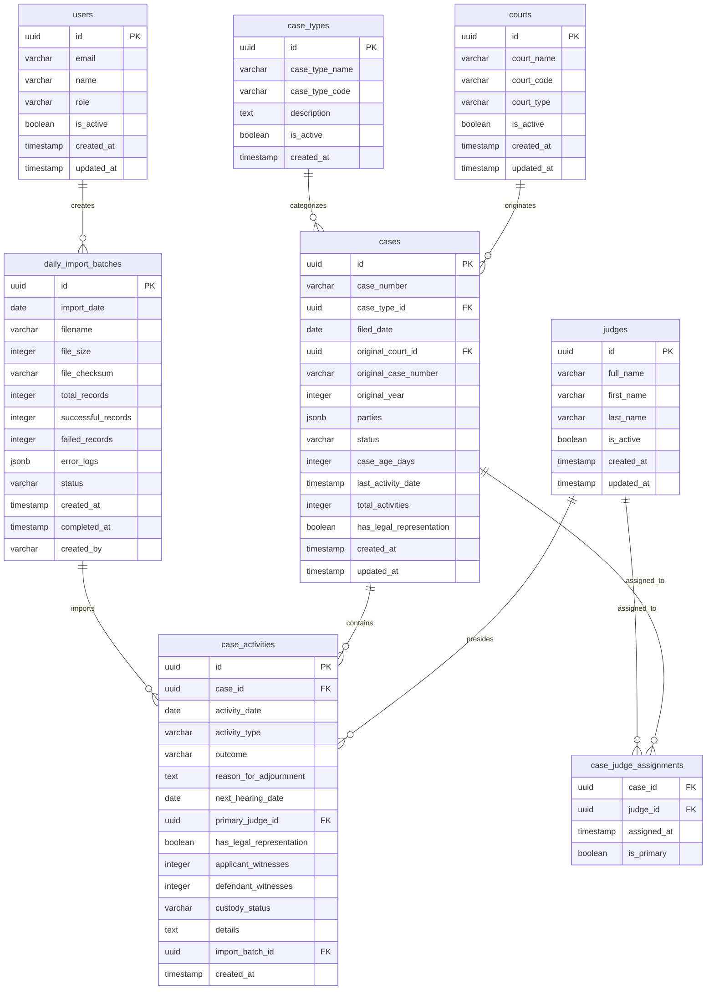
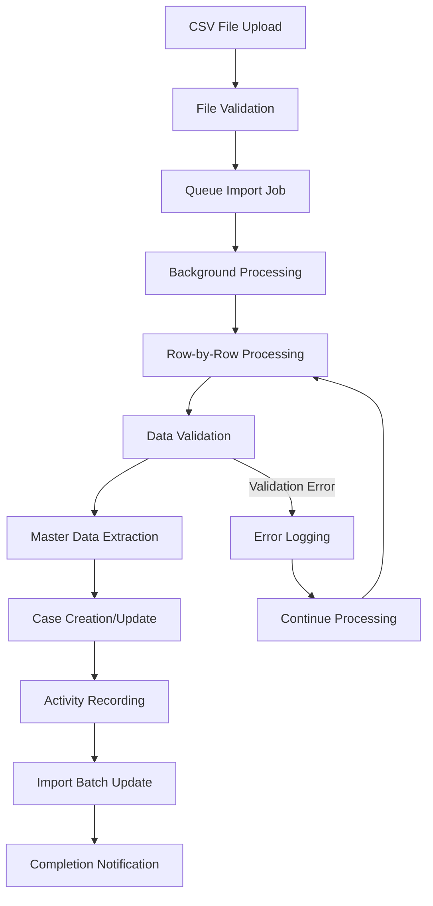

# Database Schema Implementation for Justice Caseload Management System

## Overview

This document outlines the database schema design for the Justice Caseload Management System, a modern web application that processes daily CSV imports of judicial case data. The system is built on Next.js with TypeScript and uses PostgreSQL with Prisma ORM for robust data persistence.

The schema handles daily case returns containing court proceedings, judge assignments, party details, and case outcomes while maintaining data integrity and supporting efficient analytics queries for the dashboard.

## Technology Stack & Architecture

### Database Technology
- **Primary Database**: PostgreSQL 15+ (Open-source relational database)
- **ORM**: Prisma 5.x (Type-safe database client and migration tool)
- **Connection Pooling**: PgBouncer for production connection management
- **Data Validation**: Zod 3.24.2 for schema validation
- **State Management**: TanStack Query (React Query) for caching and synchronization
- **Authentication**: NextAuth.js with database sessions
- **Background Jobs**: BullMQ with Redis for async processing
- **File Processing**: CSV-parser and fast-csv for data import
- **Environment**: Self-hosted or cloud providers (Railway, Supabase, Neon)

### Architectural Decisions
- **Relational Model**: ACID compliance with PostgreSQL for data integrity
- **Normalized Schema**: Proper foreign key relationships with selective denormalization
- **Database Indexes**: B-tree and composite indexes for query optimization
- **Real-time Updates**: Server-sent events or WebSocket connections via Next.js API routes
- **Background Processing**: Queue-based CSV import processing for large files

## Data Models & Schema Design

### Entity Relationship Diagram



### Database Tables Structure

| Table | Purpose | Key Relationships |
|-------|---------|------------------|
| `courts` | Master data for court information | Referenced by `cases.original_court_id` |
| `judges` | Master data for judge information | Referenced by `case_activities.primary_judge_id` and `case_judge_assignments` |
| `case_types` | Master data for case classifications | Referenced by `cases.case_type_id` |
| `cases` | Primary case records | Parent to `case_activities` and `case_judge_assignments` |
| `case_activities` | Individual court proceedings/activities | Child of `cases`, references `judges` and `daily_import_batches` |
| `case_judge_assignments` | Many-to-many relationship between cases and judges | Junction table |
| `daily_import_batches` | Audit trail for CSV imports | Parent to `case_activities` |
| `users` | Application users and authentication | Referenced by `daily_import_batches.created_by` |

### Key Database Features

**Data Types:**
- `UUID` for primary keys (better performance and security)
- `JSONB` for flexible nested data (parties information)
- `ENUM` types for constrained values (status, roles)
- `Date` and `Timestamp` for temporal data
- Proper `VARCHAR` sizing based on expected data length

**Indexing Strategy:**
- Primary keys (automatic B-tree indexes)
- Foreign key indexes for join performance
- Composite indexes for common query patterns
- Partial indexes for filtered queries

**Constraints:**
- Foreign key constraints for referential integrity
- Check constraints for data validation
- Unique constraints for business rules
- NOT NULL constraints for required fields

## Data Validation Schema

### CSV Import Validation

```typescript
import { z } from 'zod';

export const CaseReturnRowSchema = z.object({
  // Date fields
  date_dd: z.coerce.number().min(1).max(31),
  date_mon: z.string().length(3),
  date_yyyy: z.coerce.number().min(2020).max(2030),
  
  // Case identification
  caseid_type: z.string().min(1).max(20),
  caseid_no: z.string().min(1).max(50),
  
  // Filing information
  filed_dd: z.coerce.number().min(1).max(31),
  filed_mon: z.string().length(3),
  filed_yyyy: z.coerce.number().min(2020).max(2030),
  
  // Court information
  court: z.string().min(1).max(255),
  
  // Original case (for appeals)
  original_court: z.string().optional(),
  original_code: z.string().optional(),
  original_number: z.string().optional(),
  original_year: z.coerce.number().optional(),
  
  // Case details
  case_type: z.string().min(1).max(100),
  judge_1: z.string().min(1).max(255),
  judge_2: z.string().optional(),
  judge_3: z.string().optional(),
  judge_4: z.string().optional(),
  judge_5: z.string().optional(),
  judge_6: z.string().optional(),
  judge_7: z.string().optional(),
  
  // Activity information
  comingfor: z.string().min(1).max(100),
  outcome: z.string().min(1).max(100),
  reason_adj: z.string().optional(),
  
  // Party counts
  male_applicant: z.coerce.number().min(0).max(999),
  female_applicant: z.coerce.number().min(0).max(999),
  organization_applicant: z.coerce.number().min(0).max(999),
  male_defendant: z.coerce.number().min(0).max(999),
  female_defendant: z.coerce.number().min(0).max(999),
  organization_defendant: z.coerce.number().min(0).max(999),
  
  // Procedural details
  legalrep: z.enum(['Yes', 'No']),
  applicant_witness: z.coerce.number().min(0).max(999),
  defendant_witness: z.coerce.number().min(0).max(999),
  custody: z.coerce.number().min(0).max(999),
  other_details: z.string().optional(),
});

export type CaseReturnRow = z.infer<typeof CaseReturnRowSchema>;
```

## Data Processing Architecture

### CSV Import Processing Flow



### Master Data Management Strategy

**Court Data Processing:**
- Direct extraction from `court` column in CSV
- Automatic normalization and deduplication
- Court type inference based on names
- Separate handling of current vs original courts

**Judge Data Processing:**
- Name normalization and parsing
- Duplicate detection by full name or first/last name combination
- Support for multiple judges per case activity

**Case Type Processing:**
- Automatic code generation from case type names
- Standardized naming conventions
- Description auto-generation for new case types

## Performance Optimization

### Required PostgreSQL Indexes

```sql
-- Performance indexes for common query patterns

-- Cases table indexes
CREATE INDEX CONCURRENTLY idx_cases_status_filed_date 
ON cases (status, filed_date DESC);

CREATE INDEX CONCURRENTLY idx_cases_case_type_filed_date 
ON cases (case_type_id, filed_date DESC);

CREATE INDEX CONCURRENTLY idx_cases_filed_date 
ON cases (filed_date DESC);

-- Case activities indexes
CREATE INDEX CONCURRENTLY idx_case_activities_case_activity_date 
ON case_activities (case_id, activity_date DESC);

CREATE INDEX CONCURRENTLY idx_case_activities_judge_date 
ON case_activities (primary_judge_id, activity_date DESC);

-- JSONB indexes for party information
CREATE INDEX CONCURRENTLY idx_cases_parties_gin 
ON cases USING GIN (parties);

-- Partial indexes for active cases only
CREATE INDEX CONCURRENTLY idx_cases_active_filed_date 
ON cases (filed_date DESC) WHERE status = 'ACTIVE';
```

### Query Optimization Strategies

- Use of raw SQL for complex aggregations
- Parallel query execution for dashboard analytics
- Connection pooling with PgBouncer
- Redis caching for frequently accessed data

## Data Integrity & Consistency

### Database Constraints

```sql
-- Foreign key constraints
ALTER TABLE cases ADD CONSTRAINT fk_cases_case_type 
FOREIGN KEY (case_type_id) REFERENCES case_types(id);

ALTER TABLE cases ADD CONSTRAINT fk_cases_original_court 
FOREIGN KEY (original_court_id) REFERENCES courts(id);

ALTER TABLE case_activities ADD CONSTRAINT fk_activities_case 
FOREIGN KEY (case_id) REFERENCES cases(id) ON DELETE CASCADE;

-- Check constraints
ALTER TABLE cases ADD CONSTRAINT chk_case_age_positive 
CHECK (case_age_days >= 0);

ALTER TABLE case_activities ADD CONSTRAINT chk_witnesses_non_negative 
CHECK (applicant_witnesses >= 0 AND defendant_witnesses >= 0);
```

### Data Validation Rules

- UUID primary keys for all entities
- Mandatory fields enforced at database level
- JSONB validation for party information structure
- Enum constraints for status fields
- Date range validation for activity dates

## Testing Strategy

### Unit Testing Framework

```typescript
// Test database setup with Prisma
const testPrisma = new PrismaClient({
  datasources: {
    db: {
      url: generateTestDatabaseUrl(),
    },
  },
});

describe('Case Management Operations', () => {
  beforeEach(async () => {
    await testPrisma.$executeRaw`BEGIN`;
  });
  
  afterEach(async () => {
    await testPrisma.$executeRaw`ROLLBACK`;
  });
  
  it('should create case with valid CSV data', async () => {
    const csvRow = createValidCsvRow();
    const result = await processCsvRow(csvRow);
    
    expect(result.success).toBe(true);
    expect(result.caseId).toBeDefined();
  });
});
```

## Migration & Backup Strategy

### Database Migration Process

1. **Pre-migration Backup**: Automated backup creation before schema changes
2. **Migration Execution**: Prisma migrate deploy with rollback capability
3. **Data Validation**: Post-migration data integrity checks
4. **Performance Monitoring**: Index usage and query performance validation

### Backup Configuration

- **Daily Backups**: Automated PostgreSQL dumps with compression
- **Retention Policy**: 30-day retention for daily backups
- **Cloud Storage**: Optional S3/cloud storage integration
- **Point-in-time Recovery**: WAL archiving for production environments